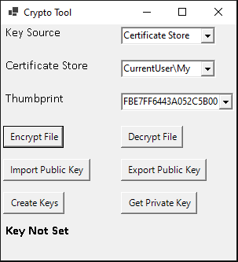

# Encrypting and Decrypting Scripts

Scripts can be encrypted to help prevent malicious actors from manipulating code. 
The method of encryption is two fold. The script contents are encrypted using a AES 256-bit symmetric encryption algorithm. 
The AES encryption key and initialization vector are subsequently encrypted using an RSA key-pair consisting of a public key and private key.
Users creating or modifying scripts will have access to the public key in order to encrypt the clear text code. 
At run time, the user executing the script will use the private key to decrypt the ciphertext. 

All scripts should also be signed with a valid signature to ensure script integrity. For additional security, this should be enforced via Execution Policy.

There are two options of sourcing the cryptographic keys:
1. Using a Cryptographic Service Provider (CSP) Key Container
    * This is a persistent container located in the user's local application data (%APPDATA%\Microsoft\Crypto\RSA)
    * Once the container and keys are created, the public key may be exported and shared 
2. Using an X509 Certificate
    * The certificate and private key are installed in a certificate store on the machine where the scripts are to be run
    * The certificate sans private key (AKA public key) is installed in the certificate stores of those users needing to encrypt the data

## Cryptographic Tool
The form below abstracts the cryptographic operations when interactively encrypting and decrypting data. This tool can encrypt/decrypt using either key source (described above). 

 

#### To create keys, encrypt, and decrypt
1. Click the `Create Keys` button. The label displays the key name and shows that it is a full key pair.
2. Click the `Export Public Key` button. Note that exporting the public key parameters does not change the current key.
3. Click the `Encrypt File` button and select a file.
4. Click the `Decrypt File` button and select the file just encrypted.
5. Examine the file just decrypted.

#### To encrypt using the public key
1. Click the `Import Public Key` button. The label displays the key name and shows that it is public only.
2. Click the `Encrypt File` button and select a file.
3. Click the `Decrypt File` button and select the file just encrypted.   This will fail because you must have the private key to decrypt.

This scenario demonstrates having only the public key to encrypt a file for another person. Typically that person would give you only the public key and withhold the private key for decryption.

#### To decrypt using the private key
1. Click the `Get Private Key` button. The label displays the key name and shows whether it is the full key pair.
2. Click the `Decrypt File` button and select the file just encrypted. This will be successful because you have the full key pair to decrypt.

### Application Configuration
#### Form configuration
The application uses an `App.config` file containing filepaths directing where encrypted ciphertext and decrypted clear text is written. These keys are *EncryptFolder* and *DecryptFolder*, respectively. Additionally, a *SourceFolder* key controls the initial directory of the file browser dialog objects. 

#### Run-EncryptedScript.ps1
The script gets the encrypted filepath and key source as parameter input. A temporary cleartext file is created and executed from the calling users `%TEMP%` folder. Upon completion, this temporary file is removed.

## Setup

### Server Setup

Run where files are being decrypted.

#### CSP Key Container
1. On the machine where the scripts are to be executed, run `ISD\Scripts\CryptoForm.ps1` in the context of the calling user.
2. Update the `Key Container Name` to a meaningful value.
3. Click `Create Keys` to create a new RSA Key Pair
4. With the keys created, click `Export Public Key`. This key will be used for future encryption operations. 

#### X509 Certificate
1. Request a certificate and private key from a CA. Ensure this certificate has the *KeyEncipherment* **Key Usage**
2. In the context of the user needing to decrypt the data, install the certificate and private key in `Cert:\CurrentUser\My`

    Note: for gMSAs, use PSEXEC.exe to start a powershell session as the gMSA. Run certmgr.msc.
    
3. Export the public key for use in future encryption operations:
    ```powershell
    Export-Certificate -Cert Cert:\CurrentUser\My\<Thumbprint> -FilePath <Some Filepath>
    ```
### Client Setup

Run where files are being encryped.

#### CSP Key Container 

Execute `CryptoForm.ps1` to open the Crypto tool. Enter the name of the Key Container, and click `Import Public Key`. Navigate to the location where the key was previously exported and click ok. The public key should now be safely stored in a secure key container in the current user's local application data (%APPDATA%\Microsoft\Crypto\RSA) 

#### X509 Certificate

1. Install the certificate (Public Key) in `Cert:\CurrentUser\My`