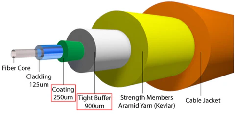

# Cable Components:
 * outer cable jacket
 * strenth member
    * tensile strength for pulling cable
 * buffer
    * tight buffer
      * thermoplastic coating surrounding fiber. Greater flexibility. Used indoors for tighter turns etc.
    * loose buffer
      * increased protection. usually used outside (burying, etc.)
 * fiber
   * coating
   - cladding
   - core 

# Cable Types:
 ## Simplex
   * single core, one-way transmission
   * cheap
   * easy to make
 ## Duplex
   * 2 fiber cores
   * 1 transmit
   * 1 receive
 ## Multi-Fiber
   * 2 to 800 strands
   * pairs of two (1 tx 1 rx)

# Transmission Modes:
 ## Single Mode
 - small micron core (typically 8 microns, but can range 8-10 microns)
 - light travels in straight line down the core
	- fastest speed
	- use over long distances (WANs)
 ## MultiMode
 - large diameter core (typically 62.5 microns but can range from 50-100 microns)
 - bounces/reflects as it travels down core
 - use more in LANs
 
# Fiber Color Code - up to 12 fibers in the following order
 - Blue 	(1)
 - Orange 	(2)
 - Green 	(3)
 - Brown 	(4)
 - Slate 	(5)
 - White 	(6)
 - Red 		(7)
 - Black 	(8)
 - Yellow 	(9)
 - Violet 	(10)
 - Rose 	(11)
 - Aqua 	(12)